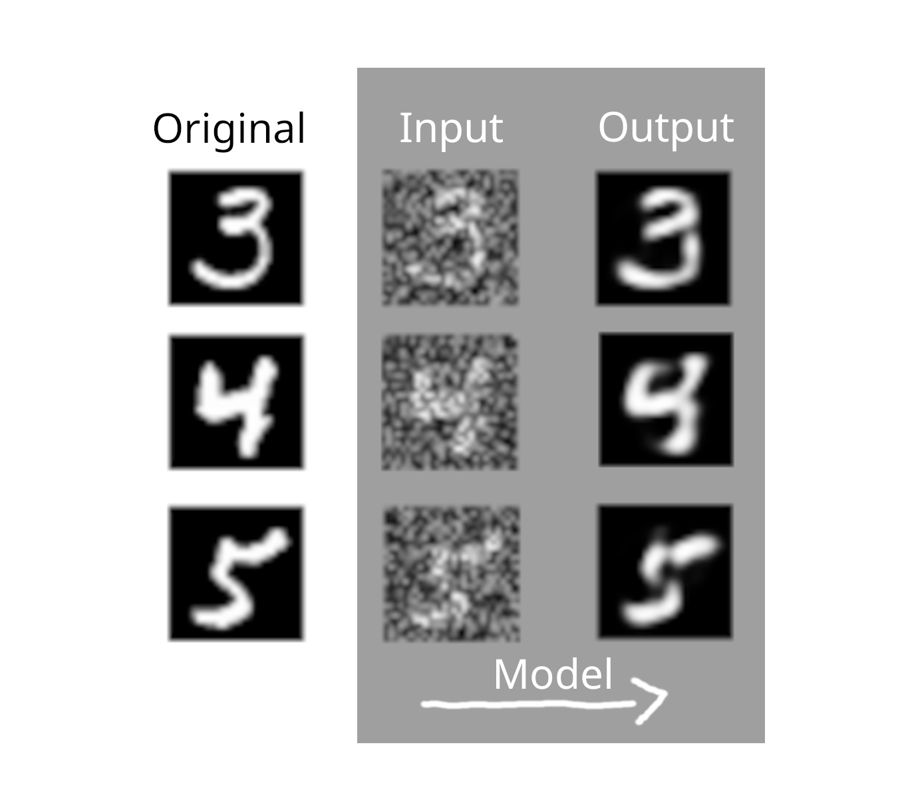

# showcase

A showcase of programming projects, experiments and solutions.

| Project | Details |
|---|---|
| [Tiny-Mnist-Denoiser](./tiny-mnist-denoiser/) | Tiny (~200kb) deep learning model to denoise a hand-drawn digit  |

## Copyright

Copyright 2025 Victor Steinborn

## License

This project is licensed under the GNU Affero General Public License - see the [LICENSE](LICENSE) file for details.
