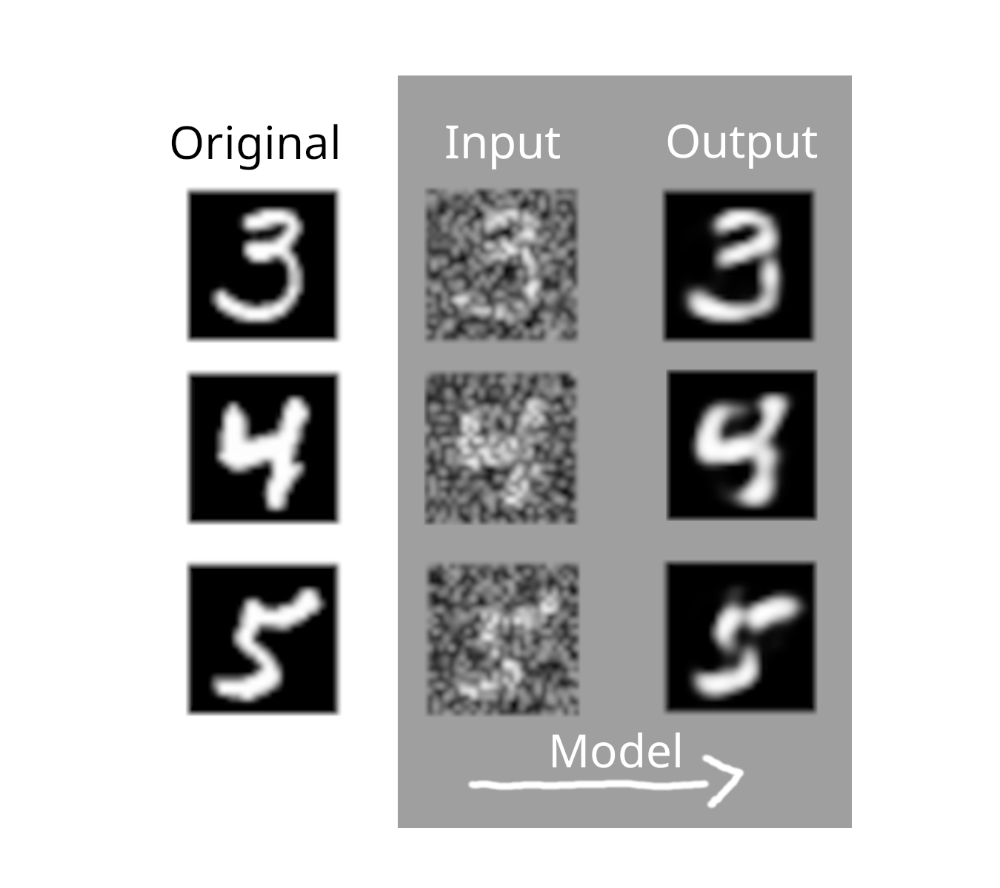

# tiny-mnist-denoiser

This repository contains a tiny (~200kb) denoiser for MNIST images. The denoiser is trained on a subset of the MNIST dataset and aims to remove noise from noisy MNIST images.

This is a JAX implementation of the denoiser described in Umberto Michelucci's article "An Introduction to Autoencoders", available [here](https://arxiv.org/abs/2201.03898).

## Getting Started

To get started, follow these steps:

1. Clone this repository: `git clone https://github.com/vsteinborn/tiny-mnist-denoiser`
2. Install required python dependencies: `pip install -r requirements.txt`

- You can train the denoiser by running the `de-noiser.py` script (sane hyperparameters are pre-set at the top of the script).
- The trained denoiser parameters are also available at `out/de-noiser/parameters.pkl`.

## Contributing

Contributions are welcome! If you find any issues or have suggestions for improvements, please open an issue or submit a pull request.
